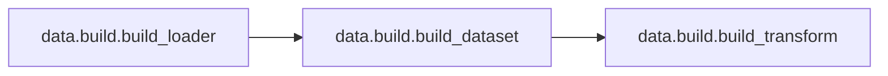
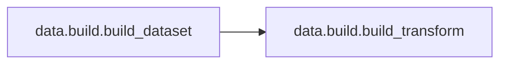

# Data Build

[_Documentation generated by Documatic_](https://www.documatic.com)

<!---Documatic-section-Codebase Structure-start--->
## Codebase Structure

<!---Documatic-block-system_architecture-start--->
```mermaid
None
```
<!---Documatic-block-system_architecture-end--->

# #
<!---Documatic-section-Codebase Structure-end--->

<!---Documatic-section-data.build.build_loader-start--->
## [data.build.build_loader](3-data_build.md#data.build.build_loader)

<!---Documatic-section-build_loader-start--->


### Object Calls

* [data.build.build_dataset](3-data_build.md#data.build.build_dataset)

<!---Documatic-block-data.build.build_loader-start--->
<details>
	<summary><code>data.build.build_loader</code> code snippet</summary>

```python
def build_loader(config):
    config.defrost()
    (dataset_train, config.MODEL.NUM_CLASSES) = build_dataset(is_train=True, config=config)
    config.freeze()
    print(f'local rank {config.LOCAL_RANK} / global rank {dist.get_rank()} successfully build train dataset')
    (dataset_val, _) = build_dataset(is_train=False, config=config)
    print(f'local rank {config.LOCAL_RANK} / global rank {dist.get_rank()} successfully build val dataset')
    num_tasks = dist.get_world_size()
    global_rank = dist.get_rank()
    if config.DATA.ZIP_MODE and config.DATA.CACHE_MODE == 'part':
        indices = np.arange(dist.get_rank(), len(dataset_train), dist.get_world_size())
        sampler_train = SubsetRandomSampler(indices)
    else:
        sampler_train = torch.utils.data.DistributedSampler(dataset_train, num_replicas=num_tasks, rank=global_rank, shuffle=True)
    if dataset_val is None:
        sampler_val = None
    else:
        indices = np.arange(dist.get_rank(), len(dataset_val), dist.get_world_size())
        sampler_val = SubsetRandomSampler(indices)
    data_loader_train = torch.utils.data.DataLoader(dataset_train, sampler=sampler_train, batch_size=config.DATA.BATCH_SIZE, num_workers=config.DATA.NUM_WORKERS, pin_memory=config.DATA.PIN_MEMORY, drop_last=True)
    if dataset_val is None:
        data_loader_val = None
    else:
        data_loader_val = torch.utils.data.DataLoader(dataset_val, sampler=sampler_val, batch_size=config.DATA.TEST_BATCH_SIZE, shuffle=False, num_workers=config.DATA.NUM_WORKERS, pin_memory=config.DATA.PIN_MEMORY, drop_last=False)
    mixup_fn = None
    mixup_active = config.AUG.MIXUP > 0 or config.AUG.CUTMIX > 0.0 or config.AUG.CUTMIX_MINMAX is not None
    if mixup_active:
        mixup_fn = Mixup(mixup_alpha=config.AUG.MIXUP, cutmix_alpha=config.AUG.CUTMIX, cutmix_minmax=config.AUG.CUTMIX_MINMAX, prob=config.AUG.MIXUP_PROB, switch_prob=config.AUG.MIXUP_SWITCH_PROB, mode=config.AUG.MIXUP_MODE, label_smoothing=config.MODEL.LABEL_SMOOTHING, num_classes=config.MODEL.NUM_CLASSES)
    return (dataset_train, dataset_val, data_loader_train, data_loader_val, mixup_fn)
```
</details>
<!---Documatic-block-data.build.build_loader-end--->
<!---Documatic-section-build_loader-end--->

# #
<!---Documatic-section-data.build.build_loader-end--->

<!---Documatic-section-data.build.build_dataset-start--->
## [data.build.build_dataset](3-data_build.md#data.build.build_dataset)

<!---Documatic-section-build_dataset-start--->


### Object Calls

* [data.build.build_transform](3-data_build.md#data.build.build_transform)

<!---Documatic-block-data.build.build_dataset-start--->
<details>
	<summary><code>data.build.build_dataset</code> code snippet</summary>

```python
def build_dataset(is_train, config):
    if config.DATA.DATASET == 'imagenet':
        transform = build_transform(is_train, config)
        prefix = 'train' if is_train else 'val'
        if config.DATA.ZIP_MODE:
            ann_file = prefix + '_map.txt'
            prefix = prefix + '.zip@/'
            dataset = CachedImageFolder(config.DATA.DATA_PATH, ann_file, prefix, transform, cache_mode=config.DATA.CACHE_MODE if is_train else 'part')
        else:
            nori_root = os.path.join('/home/dingxiaohan/ndp/', 'imagenet.train.nori.list' if is_train else 'imagenet.val.nori.list')
            if os.path.exists(nori_root):
                from nori_dataset import ImageNetNoriDataset
                dataset = ImageNetNoriDataset(nori_root, transform=transform)
            else:
                import torchvision
                print('use raw ImageNet data')
                dataset = torchvision.datasets.ImageNet(root=config.DATA.DATA_PATH, split='train' if is_train else 'val', transform=transform)
        nb_classes = 1000
    elif config.DATA.DATASET == 'cf100':
        mean = [0.5070751592371323, 0.48654887331495095, 0.4409178433670343]
        std = [0.2673342858792401, 0.2564384629170883, 0.27615047132568404]
        if is_train:
            transform = transforms.Compose([transforms.RandomCrop(32, padding=4), transforms.RandomHorizontalFlip(), transforms.ToTensor(), transforms.Normalize(mean, std)])
            dataset = datasets.CIFAR100(root=config.DATA.DATA_PATH, train=True, download=True, transform=transform)
        else:
            transform = transforms.Compose([transforms.ToTensor(), transforms.Normalize(mean, std)])
            dataset = datasets.CIFAR100(root=config.DATA.DATA_PATH, train=False, download=True, transform=transform)
        nb_classes = 100
    else:
        raise NotImplementedError('We only support ImageNet and CIFAR-100 now.')
    return (dataset, nb_classes)
```
</details>
<!---Documatic-block-data.build.build_dataset-end--->
<!---Documatic-section-build_dataset-end--->

# #
<!---Documatic-section-data.build.build_dataset-end--->

<!---Documatic-section-data.build.build_transform-start--->
## [data.build.build_transform](3-data_build.md#data.build.build_transform)

<!---Documatic-section-build_transform-start--->
<!---Documatic-block-data.build.build_transform-start--->
<details>
	<summary><code>data.build.build_transform</code> code snippet</summary>

```python
def build_transform(is_train, config):
    resize_im = config.DATA.IMG_SIZE > 32
    if is_train:
        if config.AUG.PRESET is None:
            transform = create_transform(input_size=config.DATA.IMG_SIZE, is_training=True, color_jitter=config.AUG.COLOR_JITTER if config.AUG.COLOR_JITTER > 0 else None, auto_augment=config.AUG.AUTO_AUGMENT if config.AUG.AUTO_AUGMENT != 'none' else None, re_prob=config.AUG.REPROB, re_mode=config.AUG.REMODE, re_count=config.AUG.RECOUNT, interpolation=config.DATA.INTERPOLATION)
            print('=============================== original AUG! ', config.AUG.AUTO_AUGMENT)
            if not resize_im:
                transform.transforms[0] = transforms.RandomCrop(config.DATA.IMG_SIZE, padding=4)
        elif config.AUG.PRESET.strip() == 'raug15':
            from randaug import RandAugPolicy
            transform = transforms.Compose([transforms.RandomResizedCrop(config.DATA.IMG_SIZE), transforms.RandomHorizontalFlip(), RandAugPolicy(magnitude=15), transforms.ToTensor(), transforms.Normalize(IMAGENET_DEFAULT_MEAN, IMAGENET_DEFAULT_STD)])
            print('---------------------- RAND AUG 15 distortion!')
        elif config.AUG.PRESET.strip() == 'weak':
            transform = transforms.Compose([transforms.RandomResizedCrop(config.DATA.IMG_SIZE), transforms.RandomHorizontalFlip(), transforms.ToTensor(), transforms.Normalize(IMAGENET_DEFAULT_MEAN, IMAGENET_DEFAULT_STD)])
        elif config.AUG.PRESET.strip() == 'none':
            transform = transforms.Compose([transforms.Resize(config.DATA.IMG_SIZE, interpolation=_pil_interp(config.DATA.INTERPOLATION)), transforms.CenterCrop(config.DATA.IMG_SIZE), transforms.ToTensor(), transforms.Normalize(IMAGENET_DEFAULT_MEAN, IMAGENET_DEFAULT_STD)])
        else:
            raise ValueError('???' + config.AUG.PRESET)
        print(transform)
        return transform
    t = []
    if resize_im:
        if config.TEST.CROP:
            size = int(256 / 224 * config.DATA.TEST_SIZE)
            t.append(transforms.Resize(size, interpolation=_pil_interp(config.DATA.INTERPOLATION)))
            t.append(transforms.CenterCrop(config.DATA.TEST_SIZE))
        else:
            t.append(transforms.Resize(config.DATA.TEST_SIZE, interpolation=_pil_interp(config.DATA.INTERPOLATION)))
            t.append(transforms.CenterCrop(config.DATA.TEST_SIZE))
    t.append(transforms.ToTensor())
    t.append(transforms.Normalize(IMAGENET_DEFAULT_MEAN, IMAGENET_DEFAULT_STD))
    trans = transforms.Compose(t)
    return trans
```
</details>
<!---Documatic-block-data.build.build_transform-end--->
<!---Documatic-section-build_transform-end--->

# #
<!---Documatic-section-data.build.build_transform-end--->

[_Documentation generated by Documatic_](https://www.documatic.com)